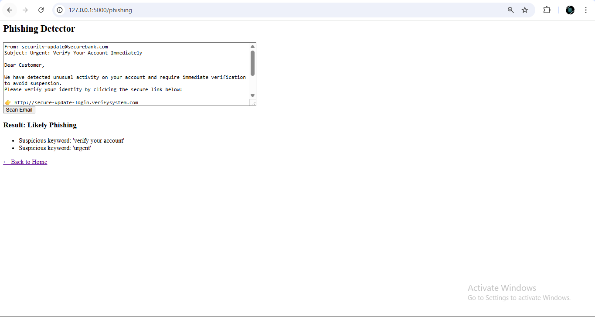
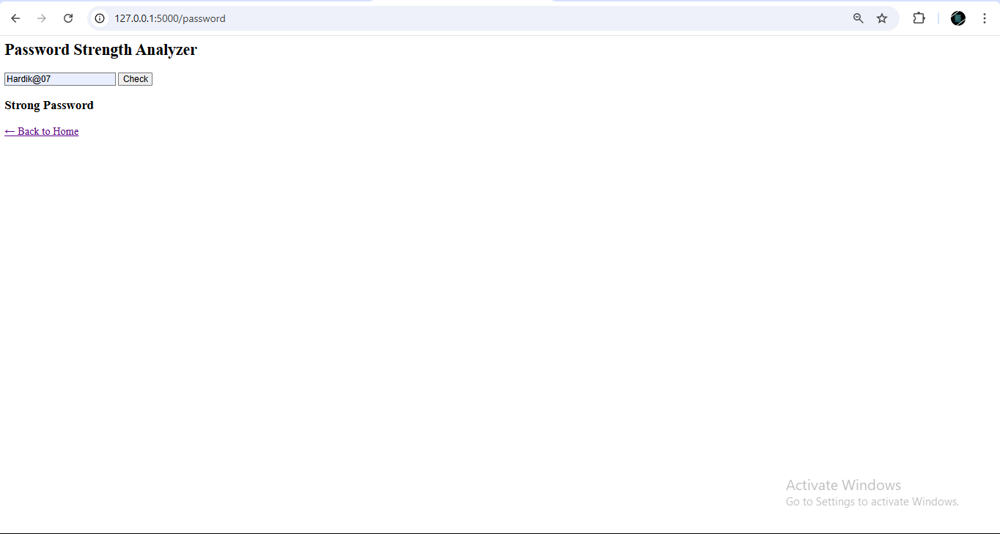

🛡️ **Cybersecurity Toolkit**  
A simple Flask web app for phishing detection and password strength analysis.

---

🧩 **About the Project**  
This toolkit is built to help users improve their **cybersecurity awareness**. It lets users:

- 📨 Analyze email content for **phishing threats**
- 🔑 Check the **strength of passwords**
- 🌐 Use a clean, interactive web interface for instant results

---

🛠️ **What It Does**

- ✉️ Detects suspicious keywords, malicious links, and risky attachments in email text
- 🔐 Evaluates passwords based on length, character variety, and special characters
- 📋 Shows easy-to-read feedback highlighting weak points

---

🎯 **Skills I Practiced**

- Flask web development and Python app structuring
- Email parsing, regex-based detection, and simple heuristics
- HTML templating with dynamic content
- Building user-friendly forms and feedback systems

---

🧪 **Sample Outputs**

📸 **Phishing Email Detection Output**

🔐 **Password Strength Checker Output**

